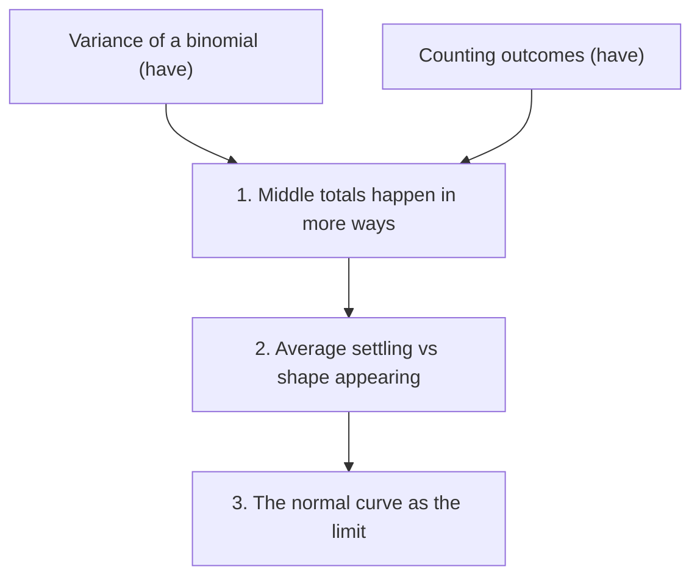

# The notes file

One file per lesson: `learn/<lesson>/notes.md` (`learn/normal-distribution/notes.md`).
I reread it before an exam, and you read it at the start of the next session, so it has
to make sense without the chat. It is the one file in the lesson folder that you keep
editing; screens and simulations are added, never replaced.

## Template

````markdown
# Normal distribution

**Goal:** see why totals of many coin flips make a bell shape.
**What it is for:** judging whether 60 heads in 100 flips is luck or a biased coin.
**Time:** 20 minutes

## Where I started

- Solid: variance of a binomial; counting outcomes.
- Edge: mixes up the law of large numbers with the central limit theorem.

## The map



## Steps

### 1. Middle totals happen in more ways ✓

**Why:** one flip is 0 or 1, which is flat. Something has to create the hump.
**The idea:** 4 flips give 0 heads in 1 way, 2 heads in $\binom{4}{2} = 6$ ways, 4 heads in 1 way.
**Rests on:** counting outcomes.
**Check:** "10 flips: which total is most likely?" → answered 5 ✓

### 2. Average settling vs shape appearing

(in progress)

## Simulations

- `sims/coin-flips.html`: totals of n coin flips, with the theory curve.

## Where we stopped

- Done: box 1.
- Next: box 2.
- Still shaky: which law says what.
````

## Rules

- Create the file right after I approve the plan. Update it after every checked box.
- Write the idea the way it finally made sense to me, not as a textbook would.
- Maths in LaTeX here (`$...$`, `$$...$$`): GitHub and most Markdown previews render it.
- Mermaid labels go in double quotes, as above, or brackets and colons break the diagram.
- The graph has the same boxes and the same arrows as the `## Map` on the screens.
- Mark a box ✓ only after I passed its check.
- Rewrite "Where we stopped" on every update; it is the first thing read next time.
- Record wrong answers too. A mistake I made is the most useful line to reread.
